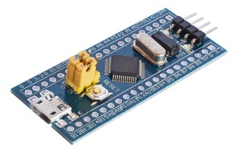
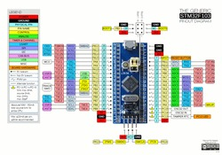
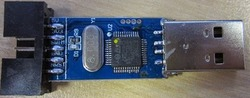

# STM32F103C8T6 & ARDUINO
Notes on using __Arduino_Core_STM32__ with "Bluepill"

2 Dec 2018

This page entry is merely some personal jottings/observations/experiences using STM32F103, mostly as "Bluepill" 64k flash 'F103C8T6. The 'F103 is ST's version of the arm M3 CPU.

Current "Core" (that code the Arduino's Board Manager option can add) = STmicroelectronics's __Arduino-Core_STM32__,  See https://github.com/stm32duino/Arduino_Core_STM32 .

The LeafLabs Maple and Maple Mini boards (using the 128k flash version of the 'F103) generated a valiant software industry since about 2011, trying to make the 'F103 work easily with the Arduino IDE. Approach has been to use a flash-resident bootloader to make the M3's native USB ability to give a functioning USB port on the board. That USB port then can allow the Arduino IDE to program a sketch or to use a serial terminal. In time-honoured Arduino UNO fashion. The maple "core" uses the "libmaple" library derived from original maple board years. The current version of the old maple-style arduino "core" is the very similarly named "Arduino-STM32" here, still maintained by Roger Clark: https://github.com/rogerclarkmelbourne/Arduino_STM32. 

Note that all these boards have no separate USB chip (as on the UNO or NANO) to do USB. But USB is possible directly from 2 pins of the M3 itself, if given some driver code (in the maple-derived bootloader). The USB-capable pins __are__ connected to the USB connector.

The newer Arduino_Core_STM32 version of Arduino support is from the ST company and is based on ST's HAL code (not on the earlier handcrafted libmaple). There is currently no available flash-loaded bootloader. So USB is not a possibility for uploading your sketch. Instead, uploading is done either by STLINK adapter, or a 3 volt TTL serial adapter, and these two modes are built into the chip by manufacturer ST. STLINK mode can upload virtually any time. Uploading by serial requires a reset with "boot0" set high, to get to upload mode.

The assignment of MCU pins (PA0 PA1) against traditional Arduino D0 D1 D2 numbering or simply 0 1 2 3 numbering is dependent on configuration files in whichever core you install to your IDE. There are some (very nice) pin assignment images out there in search-space where the D0 D1 D2 etc do not agree with pin numbering in ST's core. 
I find that the easiest solution is to always in sketches use the PA0 PA1 notation, as that should always be correct no matter your hardware or your core. (That's tricky for still-available maple mini boards, as they are marked 0 1 2 !) And be careful that some boards (incl maple) use different LED or BUTTON pins anyway.

__PINS:__

Regular BluePill

 - PC13 = LED
 - PA4 PA5 PA6 PA7 = SPI1 SS, SCK, MISO, MOSI
 - PA0-PA7, PB0-PB1 = Analog (= A0-A9)
 - PB6 PB7 = SCL1 SDA1
 - PB10 PB11 = SCL2 SDA2
 - PA9 PA10 = TX1 RX1
 - PA2 PA3 = TX2 RX2
 - PB10 PB11 = TX3 RX3

[Another similar board](EnhancedBoard.md) - but with connectors for ESP8266, NRF24, SD, flash, bluetooth, EEprom, and OLED or TFT displays.

__Running Libraries?__

I have found that these codes/libraries work fine on the ST core and bluepill board:
 - Serial, Serial2 and Serial3 simultaneously
 - I2C native Wire, and native Wire2
 - Softwire I2C
 - Acrobotic OLED: native I2C, or modified slightly to use Softwire.
 - miniOled (see https://github.com/BLavery/miniOled), with native I2C or Softwire
 - UCGlib for ILI9341 SPI TFT display: slight fix for "arm"
 - UCGlib for ILI9163 SPI TFT display: on my display, needed slight fix for that pesky 32-pixel offset devil.
 - FreeRTOS
 - NRFlite (compiles, comms link not tested yet)
 - SD - SD card in a slot
 - SerialFlash on a 16x256 flash chip
 - Adxl345
 - ENC28j60 ethernet: with a bit of tweaking. Flaky. Not really happy. Awaiting a W5500 adapter instead.

__Summary:__

 - Stuff "just works"

 - Uploading "just works"  (I use $3 STLINK clone)

I'm a happy camper.

__Related:__

For my notes on the smaller STM32F030F4P6, see https://github.com/BLavery/STM32F030F4P6-Arduino  
For my notes on the 1024k STM32F407VG, see https://github.com/BLavery/STM32F407VG-Arduino  
For my notes on the SAMD21-M0-Mini, see https://github.com/BLavery/SAMD21-M0-Mini  
For my notes on using STM32 boards with ST Cube and direct C++ coding, see https://github.com/BLavery/STM32-Cube-TrueStudio

